<p align="center">
  
</p>

<p align="center">
  
  
  
  
  
  
  
  
  
</p>
<p align="center">
  
  
  
  
  
  
  
</p>

<p align="center">
  <b>BOUSSLA rapproche les pièces, les paiements observés et le contexte déclaré d'une opération commerciale.<br>
  Il explique les écarts, demande automatiquement les précisions utiles et aide l'agent fiscal à réviser le dossier —<br>
  sans jamais transformer un soupçon en score de fraude.</b>
</p>

<p align="center">
  <a href="#-en-bref">En bref</a> ·
  <a href="#-captures">Captures</a> ·
  <a href="#-parcours-de-bout-en-bout">Parcours</a> ·
  <a href="#-qui-décide-quoi">Qui décide quoi</a> ·
  <a href="#-architecture">Architecture</a> ·
  <a href="#-démarrage-rapide">Démarrage</a> ·
  <a href="#-qualité-et-validation">Validation</a> ·
  <a href="#-documents">Documents</a> ·
  <a href="docs/BOUSSLA_note_de_synthese.pdf">Note de synthèse (PDF)</a> ·
  <a href="docs/Barons.pdf">Présentation (PDF)</a>
</p>

---

## ✦ En bref

> *« Boussla ne demande pas seulement si une facture est bien calculée : il aide à comprendre à quoi elle correspond et quelles pièces expliquent un écart. »*

Une facture ne prouve ni son paiement ni l'usage des biens achetés. Pour instruire un dossier, l'agent doit croiser des observations dispersées — copie reçue par l'acheteur, émission du vendeur, règlements, affectation aux projets — puis obtenir des explications de l'entreprise. Les « scores de fraude » opaques mélangent tout et ne sont ni explicables ni contestables. BOUSSLA sépare ce qui est **observé**, **déclaré**, **calculé** et **décidé**, et garde la trace de chaque changement.

Depuis la première livraison du parcours progressif, chaque cause documentaire suit les états **non expliquée → réponse reçue → pièce reçue → pièce cohérente → résolue**. Pour une cause de poids 40, sa contribution passe de 40 à 30, 20, 10 puis 0 ; les réductions avant décision de l'agent sont indiquées comme provisoires. Le backend renvoie le score brut, le score courant et les contributions par cause. Une contradiction ou un rejet peut faire remonter la contribution. Couverture, urgence, signal historique et confiance opérationnelle sont affichés séparément. Le signal historique compare l'entreprise à ses propres périodes couvertes ; la confiance opérationnelle utilise uniquement des interactions attribuables. Chacun expose ses facteurs et reste « données insuffisantes » lorsque les observations manquent. Le frontend ne calcule aucun palier ni indicateur.

<table>
  <tr>
    <td width="33%" valign="top">
      <h3>🔗 Rapprocher</h3>
      Contrôles <b>déterministes</b> sur trois familles : concordance acheteur / vendeur (poids 35), règlement observé (25), affectation des quantités aux projets (40). Résultat : un <b>indice de priorité de revue</b> 0–100 et une couverture des preuves — jamais une probabilité de fraude.
    </td>
    <td width="33%" valign="top">
      <h3>❓ Clarifier</h3>
      Cohérence du contexte déclaré (usage, horizon, dates), puis <b>demande neutre publiée automatiquement</b> dans la boîte de l'entreprise : questions d'un catalogue fixe, 3 au maximum par tour, 2 tours, date cible de démonstration et « relance à prévoir ».
    </td>
    <td width="33%" valign="top">
      <h3>⚖️ Décider</h3>
      Seul l'<b>agent fiscal</b> accepte ou rejette une pièce. Chaque décision crée une <b>révision immuable</b> (version, idempotence, historique conservé). Une déclaration sans pièce peut être rejetée, jamais acceptée.
    </td>
  </tr>
</table>

| 12 | 147 | 282 | 135 | 12 | 29 |
|:---:|:---:|:---:|:---:|:---:|:---:|
| entreprises synthétiques<br>+ 1 cas vitrine | transactions | observations<br>de factures | paires acheteur /<br>vendeur indépendantes | mois<br>d'historique | passages de<br>référence publics |

---

## ✦ Captures

<table>
  <tr>
    <td width="50%">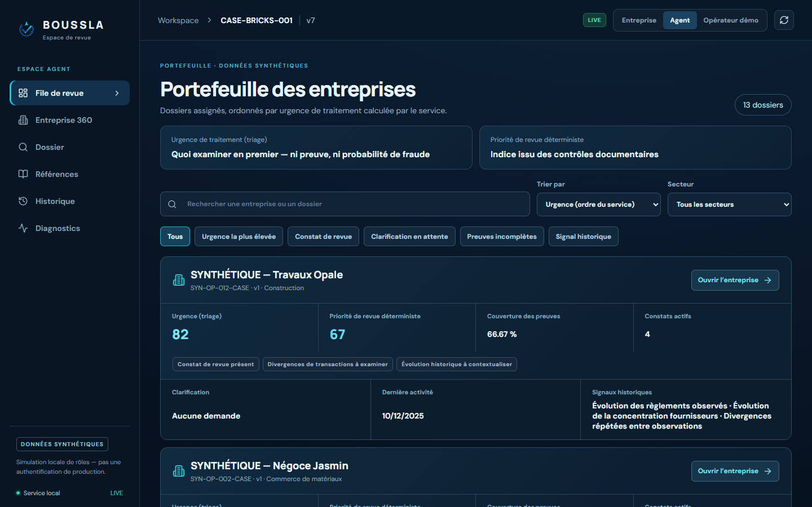<br><sub><b>Portefeuille</b> — 13 dossiers ordonnés par urgence de traitement, affichée à côté de l'indice de revue déterministe.</sub></td>
    <td width="50%">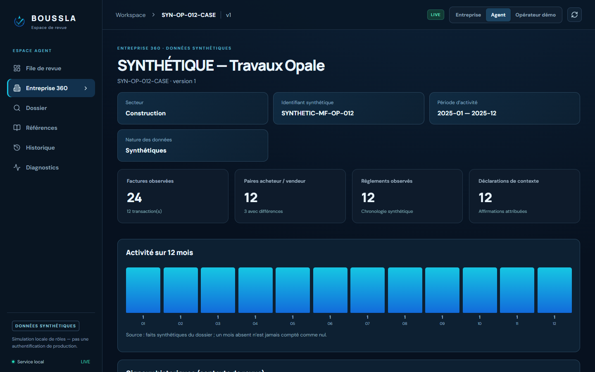<br><sub><b>Entreprise 360</b> — profil synthétique, 12 mois d'activité, paires acheteur / vendeur, règlements, instantané financier synthétique.</sub></td>
  </tr>
  <tr>
    <td>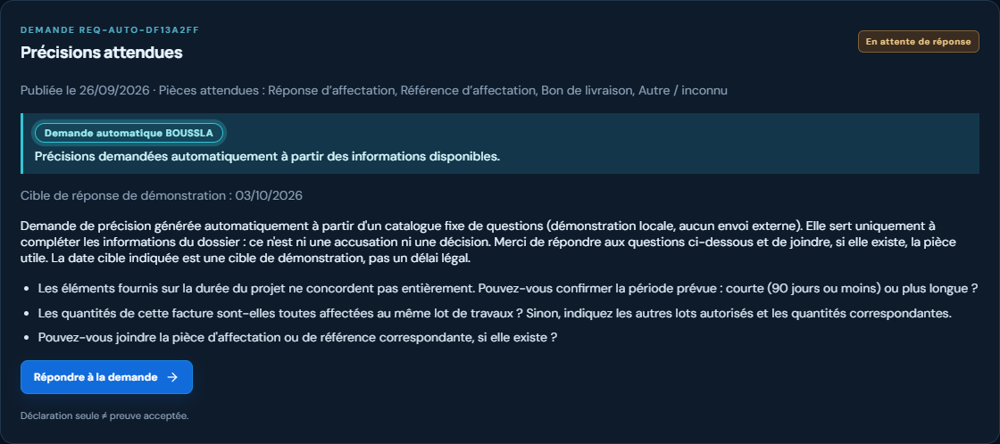<br><sub><b>Demande automatique BOUSSLA</b> — incohérence d'horizon détectée, trois questions neutres du catalogue.</sub></td>
    <td>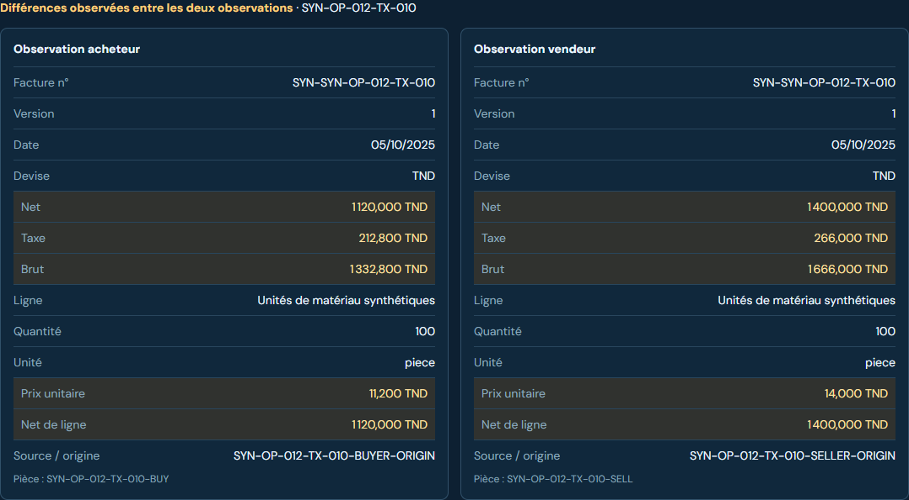<br><sub><b>Comparaison appariée</b> — seules les différences calculées par le service sont surlignées.</sub></td>
  </tr>
  <tr>
    <td>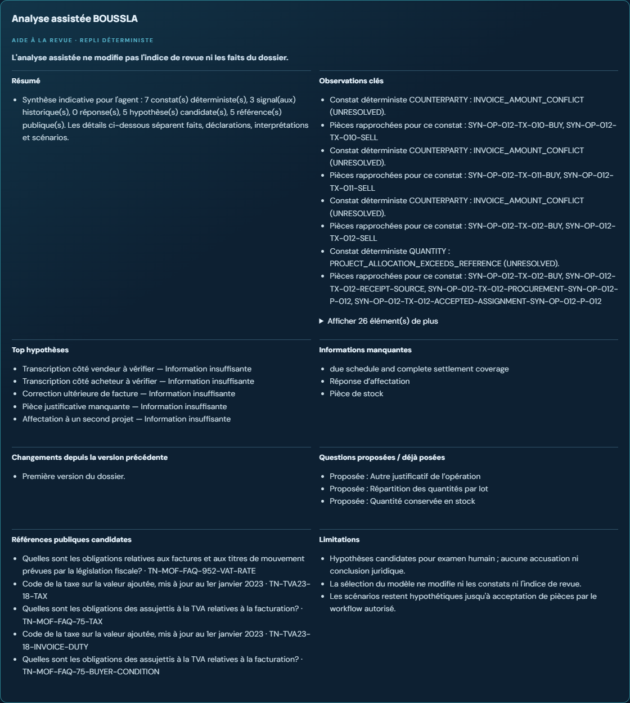<br><sub><b>Analyse assistée</b> (agent seulement) — hypothèses d'un catalogue fixe, questions, références ; ne modifie ni l'indice ni les faits.</sub></td>
    <td>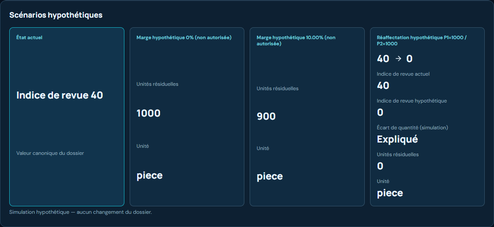<br><sub><b>Scénarios hypothétiques</b> — recalculés sur une copie non canonique : P1 = 1 000 / P2 = 1 000 donnerait 40 → 0.</sub></td>
  </tr>
  <tr>
    <td>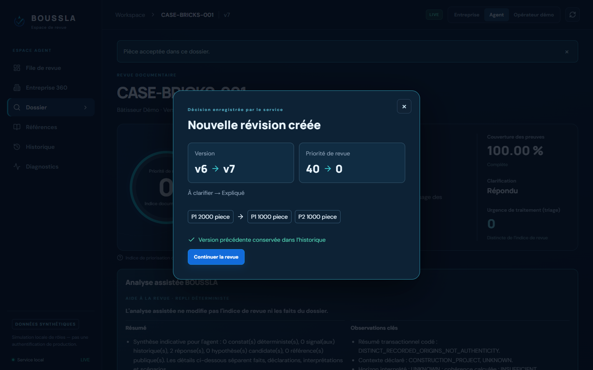<br><sub><b>Décision humaine</b> — nouvelle révision v6 → v7, priorité 40 → 0, version précédente conservée.</sub></td>
    <td>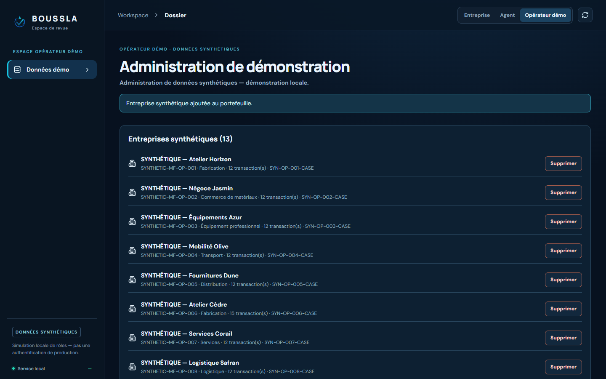<br><sub><b>Opérateur démo</b> — gestion des entreprises synthétiques, réservée à ce rôle.</sub></td>
  </tr>
</table>

<details>
<summary><b>Voir toutes les captures (13)</b></summary>

| | |
|---|---|
| 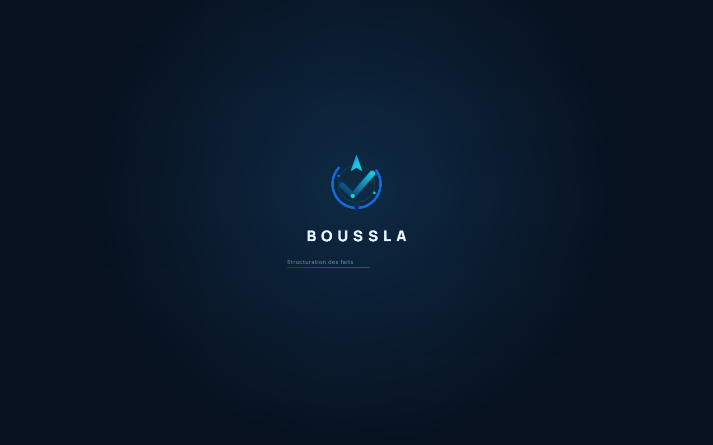 | 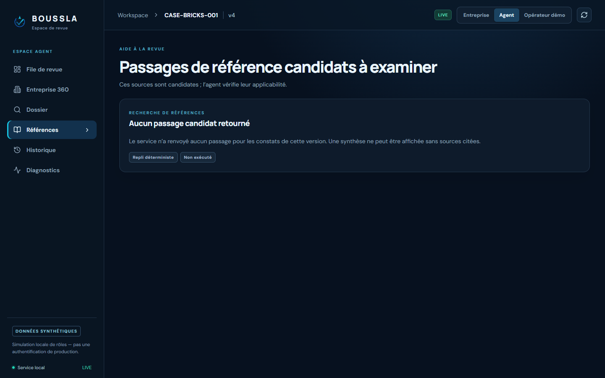 |
| 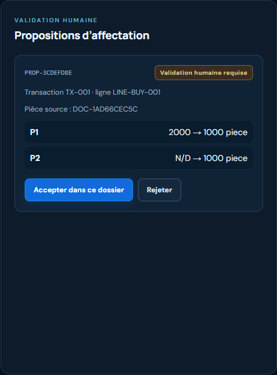 | 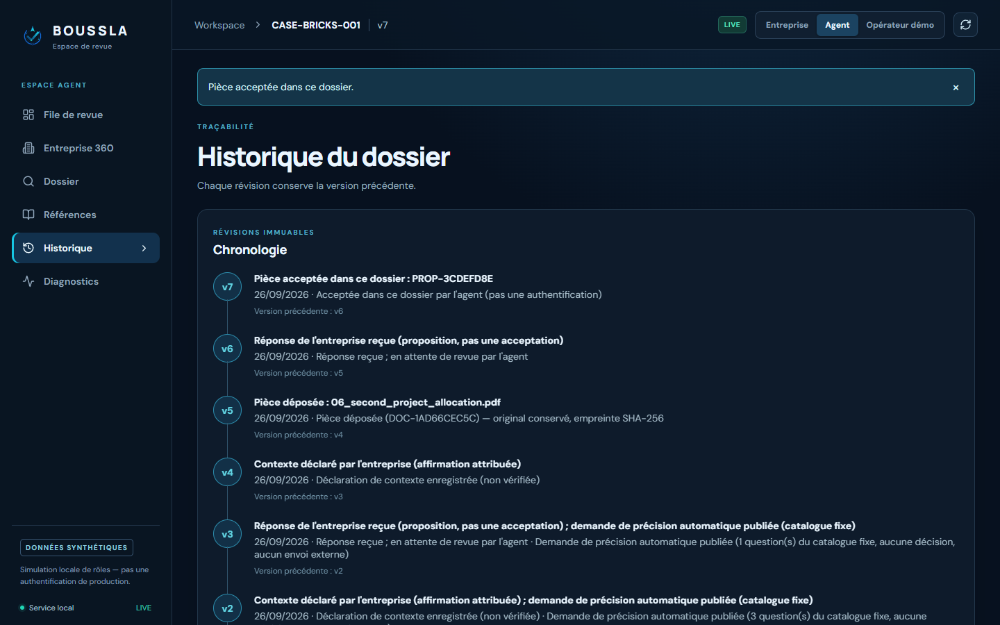 |
| 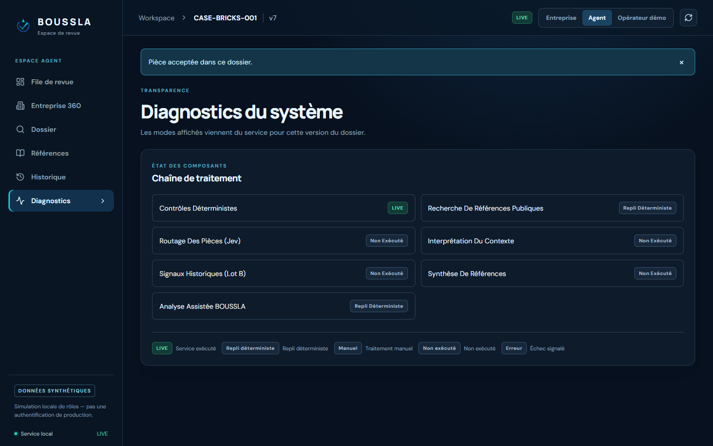 | |

</details>

---

## ✦ Parcours de bout en bout

Le cas vitrine `CASE-BRICKS-001` : 2 000 unités affectées au lot P1 alors que sa référence n'en couvre que 1 000. L'écart reste non résolu (indice 40) jusqu'à ce que l'entreprise documente une seconde affectation et que l'agent l'accepte.

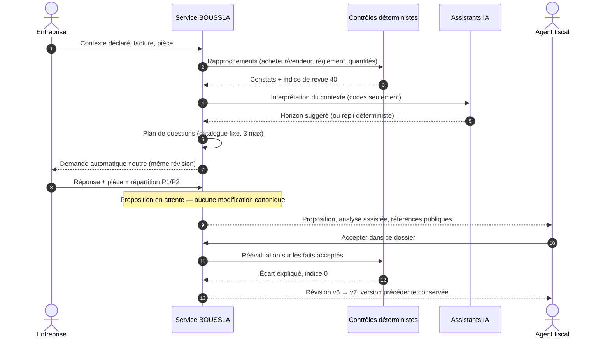

<details>
<summary><b>Cycle de vie d'une demande de précision</b></summary>

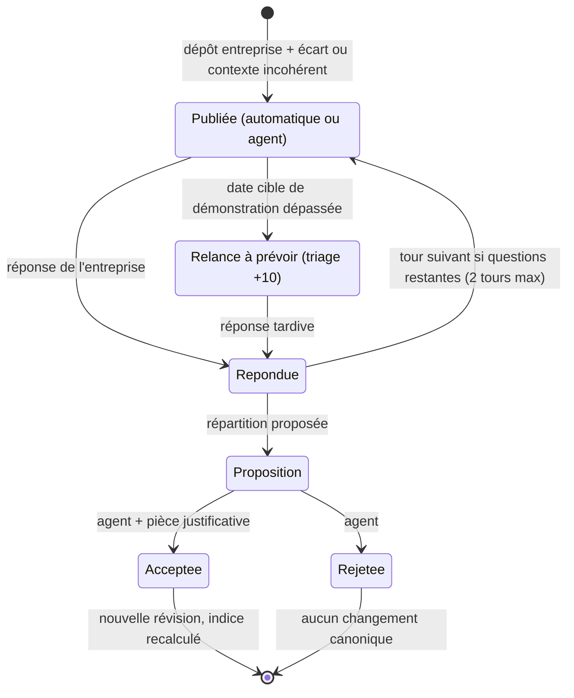

</details>

---

## ✦ Qui décide quoi

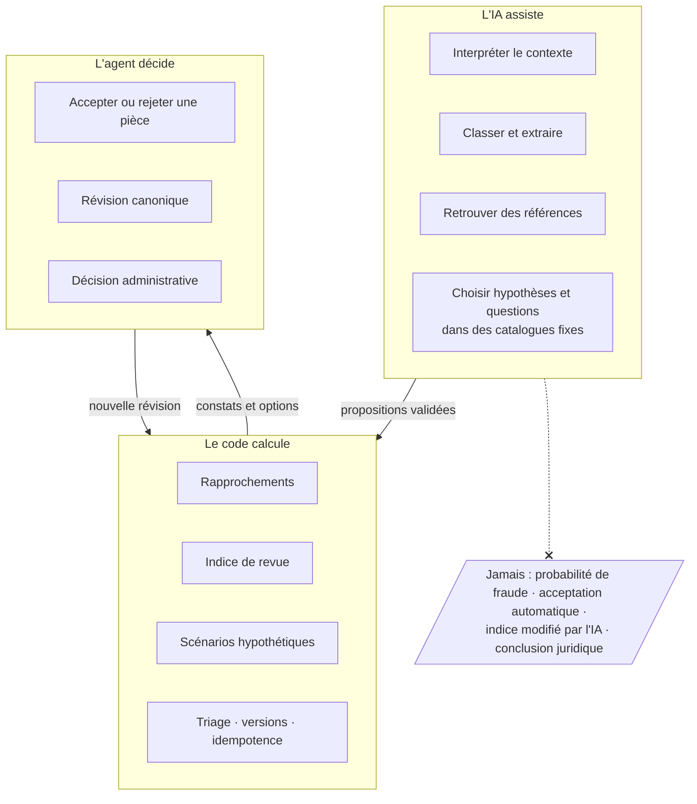

**Deux indicateurs, jamais confondus**

| | Indice de revue | Urgence de traitement (triage) |
|---|---|---|
| **Répond à** | Quels écarts sont étayés par les pièces ? | Quel dossier examiner en premier aujourd'hui ? |
| **Calcul** | Contrôles déterministes (poids 35 / 25 / 40) | `min(100, indice + points opérationnels)` — formule `triage-demo-1` |
| **Peut augmenter parce que** | un constat non résolu est étayé | demande en attente (+10), relance à prévoir (+10), demandes répétées sans réponse (+10), décision de l'agent attendue (+10), signaux historiques (+5 / +10) |
| **N'est jamais** | une probabilité de fraude | une preuve, un constat ou un soupçon |

Une absence de réponse n'augmente que l'urgence. Elle ne crée aucun constat et ne modifie jamais l'indice de revue.

---

## ✦ Architecture

```mermaid
flowchart LR
    subgraph UI["Interface React 19 · Vite · TypeScript"]
        P[Portefeuille]
        E360[Entreprise 360]
        D[Dossier agent]
        B[Boîte de demandes]
        ADM[Administration démo]
    end
    subgraph API["API Starlette"]
        R[Rôles simulés côté serveur]
        V[JSON strict · champs interdits]
    end
    subgraph SVC["Service BOUSSLA"]
        CT[Contrats Pydantic]
        ST[(SQLite append-only<br/>versions · reçus d'idempotence)]
        LG[LangGraph<br/>interruptions humaines]
        CK[ChecksEngineV4]
        TR[Triage]
        QP[Plan de questions]
    end
    subgraph AI["Assistants avec repli"]
        OA[OpenAI<br/>extraction · contexte · investigateur · RAG]
        JV[Jev / TypeSafe<br/>routage des pièces]
        QD[(Qdrant Cloud<br/>29 passages publics)]
    end
    LS[[LangSmith<br/>traces sans entrées ni sorties]]
    PF[(Portefeuille synthétique<br/>12 entreprises · 12 mois)]
    UI --> API --> SVC
    SVC -. suggestions .-> AI
    SVC -. spans expurgés .-> LS
    PF --> SVC
```

| Couche | Rôle | Si le fournisseur est absent ou en panne |
|---|---|---|
| **Contrôles déterministes** (`boussla/checks`, `scoring.py`) | Constats, indice de revue, couverture, scénarios | — (toujours actifs) |
| **OpenAI** — extraction, contexte, investigateur, synthèse RAG | Propositions et sélections dans des listes fermées | Repli déterministe étiqueté `TEMPLATE` / saisie manuelle |
| **Jev / TypeSafe** | Classe candidate des pièces déposées | Classe `OTHER_OR_UNKNOWN`, mode `MANUAL` |
| **Qdrant Cloud** — `boussla_public_references_v2` (384 dim., cosinus) | Passages publics candidats, agent seulement | Recherche lexicale locale étiquetée |
| **LangSmith** | Traces des nœuds, entrées / sorties masquées | Trace locale `runtime/events.jsonl` |

Une panne de fournisseur n'est jamais un constat : le dossier reste utilisable et le mode réel de chaque nœud est affiché dans **Diagnostics**.

---

## ✦ Démarrage rapide

**Prérequis :** Python 3.12, Node.js 20+.

```powershell
# 1. Dépendances Python
python -m venv .venv
.\.venv\Scripts\python.exe -m pip install -r requirements.txt

# 2. Interface React (build de production servi par Starlette)
npm --prefix frontend ci
npm --prefix frontend run build

# 3. Application
.\.venv\Scripts\python.exe -m uvicorn boussla.web.app:app --host 127.0.0.1 --port 8000
```

Ouvrir **http://127.0.0.1:8000**. Au premier démarrage, le cas vitrine `CASE-BRICKS-001` et les 12 entreprises du portefeuille synthétique sont chargés dans `runtime/`.

<details>
<summary><b>Linux / macOS</b></summary>

```bash
python -m venv .venv && source .venv/bin/activate
pip install -r requirements.txt
npm --prefix frontend ci && npm --prefix frontend run build
python -m uvicorn boussla.web.app:app --host 127.0.0.1 --port 8000
```

</details>

<details>
<summary><b>Configuration (optionnelle)</b></summary>

Copier `.env.example` vers `.env` (jamais commité). Sans aucune clé, l'application fonctionne entièrement hors ligne avec les replis déterministes.

| Variable | Effet |
|---|---|
| `OPENAI_API_KEY`, `OPENAI_CHAT_MODEL` | Extraction, interprétation du contexte, investigateur et synthèse de références en mode `LIVE` |
| `TYPESAFE_API_KEY` (`JEV_ENABLED`) | Routage Jev des pièces déposées |
| `QDRANT_URL`, `QDRANT_API_KEY`, `QDRANT_COLLECTION` | Recherche sémantique de références publiques |
| `LANGSMITH_API_KEY`, `LANGSMITH_TRACING`, `LANGSMITH_PROJECT` | Traçage (entrées / sorties masquées par défaut) |
| `MAX_QUESTION_ROUNDS` | Nombre de tours de questions automatiques (défaut : 2) |
| `BOUSSLA_PORTFOLIO` | Chargement du portefeuille synthétique (défaut : `true`) |
| `BOUSSLA_OS_TRUSTSTORE` | Vérification TLS via le magasin du système (antivirus / proxy) |

**Réinitialiser la démo :** arrêter le serveur et supprimer `runtime/` ; ou utiliser le rôle **Opérateur démo** → *Réinitialiser le portefeuille*.

</details>

<details>
<summary><b>Développement de l'interface</b></summary>

```bash
npm --prefix frontend run dev          # Vite sur :5173, /api proxifié vers :8000
npm --prefix frontend run typecheck
npm --prefix frontend run test         # Vitest
npm --prefix frontend run test:e2e     # Playwright (serveur sur :8000 ou BOUSSLA_E2E_URL)
```

</details>

### Rôles de démonstration

La sélection du rôle est une **simulation locale**, pas une authentification de production : le navigateur envoie seulement `X-Boussla-Demo-Role`, et le serveur résout l'acteur dans son propre registre.

| Rôle | Voit | Peut |
|---|---|---|
| **Entreprise** | Ses opérations, ses pièces, son contexte, sa boîte de demandes | Déclarer un contexte (y compris « Aucun projet / usage général »), déposer des pièces, répondre |
| **Agent** | Portefeuille, Entreprise 360, dossier, références, historique, diagnostics | Accepter / rejeter des pièces, demander des précisions supplémentaires |
| **Opérateur démo** | Administration des données synthétiques | Lister, ajouter, supprimer, réinitialiser les entreprises synthétiques |

### Parcours guidé (5 minutes)

1. **Agent → Portefeuille** : 13 dossiers triés par urgence ; ouvrir *Travaux Opale* pour l'**Entreprise 360**, les signaux historiques et la comparaison acheteur / vendeur.
2. **Entreprise → Contexte** : déclarer un horizon court avec des dates sur 18 mois → la **demande automatique** apparaît dans *Demandes*, sans action de l'agent.
3. **Entreprise → Demandes** : répondre, joindre la pièce `06_second_project_allocation.pdf`, proposer P1 = 1 000 / P2 = 1 000.
4. **Agent → Dossier** : lire l'analyse assistée et les scénarios, puis **Accepter dans ce dossier** → révision **40 → 0**, version précédente dans *Historique*.
5. **Entreprise → Contexte** : déclarer l'achat de véhicules sans projet (« Aucun projet / usage général de l'entreprise »).
6. **Opérateur démo** : ajouter puis supprimer une entreprise synthétique, réinitialiser le portefeuille.

---

## ✦ Qualité et validation

| Contrôle | Résultat |
|---|---|
| Tests backend (`python -m pytest -p no:cacheprovider`) | **488 réussis** · 0 appel réseau externe avec le réseau bloqué |
| Tests unitaires React (Vitest) · typecheck · Prettier · build | **20 / 20** · propres |
| Parcours navigateur Playwright (6 parcours + démarrage + résilience) | **8 / 8** hors ligne et **8 / 8** avec fournisseurs réels |
| Banc d'épreuve du jury, tour 2 (54 scénarios) | **0 bug** · 0 critique · 0 élevé |
| Recherche Qdrant (21 cas fixes) | top-1 **16 / 21** · top-3 **19 / 21** |
| Références publiques | 29 passages, 4 sources officielles, empreintes vérifiées |
| Scan de secrets (code, build, captures, historique) | **0** correspondance |

Le détail est consigné dans [`docs/release/FINAL_RELEASE_REPORT.md`](docs/release/FINAL_RELEASE_REPORT.md) et résumé dans la [note de synthèse (PDF, 2 pages)](docs/BOUSSLA_note_de_synthese.pdf).

---

## ✦ Documents

| Document | Contenu |
|---|---|
| 🎤 [**Présentation BOUSSLA — équipe Barons**](docs/Barons.pdf) (PDF, 15 diapositives) | Problème, intégration aux systèmes existants, flux de données actuels et cibles, architecture, IA assistive et moteurs déterministes, rapprochement bilatéral, déroulement du prototype, stack, validation, limites, feuille de route et équipe |
| 📄 [**Note de synthèse**](docs/BOUSSLA_note_de_synthese.pdf) (PDF, 2 pages) | Le projet de bout en bout : constat, parcours, modèle d'autorité, architecture, garanties, validation |
| 🧪 [**Audit et parcours manuel de la démo du 28 septembre**](docs/release/DEMO_READINESS_2026-09-28.md) | État réel des phases, résultats actuels, limites et démarrage isolé |
| 🧾 [**Rapport de version finale**](docs/release/FINAL_RELEASE_REPORT.md) | Intégration des quatre voies, banc d'épreuve tour 2, tests, fournisseurs, sécurité |

---

## ✦ Garanties de conception

- **L'indice de revue n'est pas une probabilité de fraude** ; l'urgence (triage) n'est pas une preuve.
- **Aucune acceptation automatique** : accepter exige une pièce du dossier et une décision de l'agent ; unité, devise, quantité aberrante ou champ inattendu → erreur typée.
- **Révisions immuables** : faits en ajout seul, versions, reçus d'idempotence — un double clic ne crée qu'une révision.
- **IA encadrée** : l'IA choisit dans des catalogues fixes (10 hypothèses, questions du playbook) ; toute sortie hors catalogue est écartée.
- **Références publiques seulement** : une synthèse qui affirme une applicabilité juridique définitive est rejetée, les passages restent consultables.
- **Isolation des rôles** : l'entreprise ne voit ni indice, ni triage, ni analyse assistée ; l'administration est réservée à l'opérateur démo ; identité, score et triage ne peuvent jamais être envoyés par le navigateur.
- **Confidentialité** : données entièrement synthétiques, aucun accès bancaire, traces LangSmith sans entrées ni sorties ni identifiants.

---

## ✦ Structure du projet

```text
Boussla/
├── boussla/
│   ├── contracts.py          # Contrats Pydantic partagés (source de vérité)
│   ├── services.py           # Service : seul point d'entrée des lectures / écritures
│   ├── store.py              # Magasin SQLite versionné, reçus d'idempotence
│   ├── workflow.py           # Graphes LangGraph avec interruptions humaines
│   ├── checks/ · scoring.py  # Contrôles déterministes et indice de revue
│   ├── triage.py             # Urgence de traitement (formule publiée)
│   ├── playbook.py           # Catalogue fixe de questions neutres
│   ├── context/              # Cohérence du contexte déclaré
│   ├── documents/ · adapters/# Texte PDF, intégrité, extraction, routage Jev
│   ├── retrieval/            # Références publiques, Qdrant, synthèse citée
│   ├── investigator/         # Analyse assistée (catalogue de 10 hypothèses)
│   ├── data/ · history_signals.py · portfolio_runtime.py  # Portefeuille synthétique
│   ├── observability.py      # Traces expurgées (local + LangSmith)
│   └── web/app.py            # API Starlette + service du build React
├── frontend/                 # React 19 · Vite · TypeScript · Playwright
├── fixtures/                 # Portefeuille opérationnel synthétique
├── tests/                    # pytest (backend, intégration, web, UI)
├── scripts/                  # Évaluation de la recherche, vérification des sources
└── docs/                     # Captures, note de synthèse, rapport de version, build lock
```

> L'interface Streamlit historique (`app.py`, `ui/`) est conservée pour référence ; l'application de référence est l'interface React servie par Starlette.

---

## ✦ Limites

Prototype local de hackathon : simulation de rôles (pas d'authentification de production), données synthétiques sans valeur juridique ni administrative, accès « entreprise » limité au cas vitrine, première ouverture d'un dossier en mode connecté en 2,5 à 5 s, corpus public restreint (29 passages, 4 sources).

**Pistes :** authentification et habilitations réelles, connecteurs de contrepartie (facture électronique), corpus de références élargi et révisé, évaluation sur données pilotes autorisées.

---

<p align="center">
  <br>
  <sub>BOUSSLA — équipe de 4 voies : autorité &amp; intégration · données &amp; contrôles · documents, IA &amp; RAG · interface<br>
  Distribué sous licence <a href="LICENSE">Apache 2.0</a> · Toutes les données sont synthétiques ; aucun indice n'a de portée juridique.</sub>
</p>
