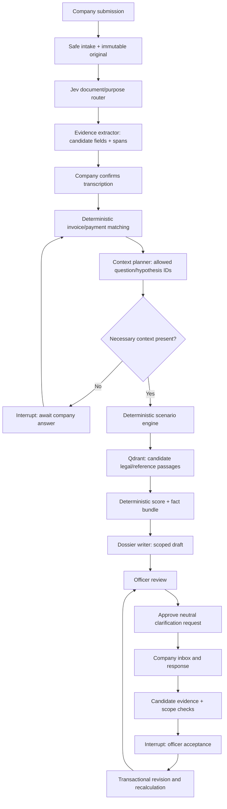

# Runtime architecture — bounded agents with deterministic controls

## A. Single application, two views

Use one Streamlit process and an application-service layer. The UI never receives database credentials or changes findings directly. A local demo actor selector is permitted ONLY with a permanent “local role simulation—not production authentication” banner. The service must still enforce role/enterprise checks on every method. Do not expose this write-enabled actor-switching mode publicly.

Roles: `COMPANY` (own data), `OFFICER` (assigned demo cases), `DEMO_OPERATOR` (fixture reset only). Counterparty observations can be preloaded by the demo operator with explicit simulated provenance. Do not create a full supplier onboarding portal tonight.

## B. Graph



The arrows indicate service sequencing, not open-ended agents talking to one another. Roles below may share one general model; only Jev needs its own adapter. Every model call is a separately typed bounded node.

## C. Functional agents

| Node/agent | Inputs | Output | Authority |
|---|---|---|---|
| Router, Jev | Small native text fragment, allowed categories | Candidate document/purpose class, model/version and uncertainty | No scores, maths, acceptance or identity proof |
| Evidence extractor | Native text pages, allowed schema | Candidate fields and exact page/text spans | Cannot copy case IDs into missing document fields |
| Context planner | Confirmed fields, stated purpose, known missing fields | Up to 3 allowed question IDs and up to 4 hypothesis IDs | Cannot invent measurements, official requirements or deadlines |
| Reconciliation/scenario engine, code | Typed facts, accepted allocations, explicit assumptions | Differences, coverage, sensitivity table, hypothesis test results | Exact arithmetic only; no guilt inference |
| Reference retriever | Scoped query, date, jurisdiction, audience | Passage IDs and source metadata | Relevance is not applicability or legal proof |
| Dossier writer | Already scoped fact IDs, checked hypotheses, candidate legal refs | Short narrative plan using permitted IDs | No free-form amounts, new evidence or sanctions |
| Review gate, code + human | Candidate change, expected version, actor | Accept/reject/request clarification | Only service commits change after authorization |

## D. Bounded execution

Initial analysis: at most 1 Jev classification batch, 1 extraction call for the two small documents, 1 context-plan call, and 1 dossier call. Skip known categories and unchanged hashes. A company answer triggers only affected nodes. Use a 2-question-round budget before “needs officer review”; prevent infinite clarification.

Proposed initial budgets: 2 primary PDF uploads per transaction, 5 pages per PDF, 10 MB per file, 50 line items per extraction, 20 KB text per document/model call, 30-second general model timeout, 5-second Jev timeout, at most one bounded retry where appropriate. These are demo settings, not provider limits. Reject or explicitly mark partial processing; never silently truncate and claim complete analysis.

Every node records `status=LIVE|CACHED|MANUAL|TEMPLATE|NOT_RUN|ERROR`, duration, version and fact IDs. A cached result needs the same case revision, document hashes, model and prompt version.

## E. State design

`AnalysisState` contains IDs and validated results, not arbitrary database connections:

```text
analysis_id, case_id, company_id, case_version, actor_id, audience
input_document_ids, evidence_bundle_hash
router_result, extraction_proposals, confirmed_field_ids
question_ids, question_round_count, claim_ids
findings, hypotheses, scenarios, candidate_rule_ids
review_index, evidence_coverage, request_draft_id
mode_by_node, error_codes
```

Persist checkpoints in `runtime/checkpoints.sqlite`, distinct from `runtime/cases.sqlite`. A checkpoint is progress, not a committed financial fact. Resume uses a server-selected thread bound to case, company, analysis and audience; never accept an arbitrary browser thread ID.

Use normal `graph.invoke` / `Command(resume=...)` for the simplest path, after verifying the installed LangGraph version. Do not catch and swallow the library's interrupt signal inside a broad exception handler. Interrupt nodes restart on resume; keep side effects outside the pre-interrupt block or make them idempotent. [WEB-LANGGRAPH]

Authorization occurs again on resume. A previously permitted checkpoint does not authorize a newly selected actor or a stale case version. If the case changed, restart analysis on the new snapshot rather than apply the stale proposal.

## F. Write transaction

`accept_evidence(actor, case_id, proposal_id, expected_version, idempotency_key)`:

1. Authenticate/resolve the demo actor and reject non-officer or wrong-enterprise access.
2. Inside the SQLite write transaction, check the action receipt using actor, case, action and idempotency key. For an identical authorized retry, return the stored outcome **before** applying a stale-version check; the original action may already have advanced the version. Reusing the key with different input is an error.
3. For a genuinely new action, validate expected version, proposal scope, company, invoice/project, item, quantity, unit, currency, period and allocation budget. A stale new action is rejected.
4. Atomically add accepted scoped evidence, create a new version, recompute deterministic findings/index, invalidate prior approvals, and record the event/action receipt.
5. Commit and return before/after fact references. No model call inside the write transaction. Database uniqueness and transaction handling must also cover two concurrent retries.

Update case facts only through this method. Do not subtract a global quantity when the evidence only supports one work package.

## G. Retrieval design

P0 Qdrant collection: `legal_reference_v1` with `rule_id`, `source_url`, `source_hash`, `document_title`, `page`, `article`, `language`, `jurisdiction`, `effective_from`, `effective_to`, `review_status`, `text`, embedding model/version.

Choose `QdrantClient(path='runtime/qdrant')` local mode for a small corpus; one shared process resource and lock. Start no external Qdrant server unless the existing app requires it. Use `query_points` according to the installed client. [WEB-QDRANT]

Suggested embedding: `sentence-transformers/paraphrase-multilingual-MiniLM-L12-v2` after confirming support in installed FastEmbed. If unavailable, use the same model with sentence-transformers if already installed; otherwise lexical retrieval over the same small corpus. Never substitute random vectors. Retain model revision and detected dimension. Keep chunks short enough for the actual encoder and verify token lengths; no silent truncation. [WEB-EMBED]

Index 10–30 carefully selected passages, not the full JORT. The primary data tables stay in SQLite/Parquet. Do NOT retrieve exact invoices, tax IDs, money or case membership by embedding proximity.

Company history retrieval is SQL and case-scoped for P0. If later embedding company documents, separate collection or strict server-enforced company/audience filters before retrieval and again before output. Never create a global cross-company nearest-neighbor prompt.

A retrieved legal card is a candidate. The app shows its review status. Unreviewed applicability can be displayed to the officer as a question, but not automatically inserted as an operative demand to the company. Example engineering rules are `DEMO_POLICY`, never disguised as law.

## H. Tracing and privacy

Use LangSmith to observe node order, status, latency, token usage when supplied by a provider, prompt/model versions and error categories. Local append-only-style events retain the case history. Do not claim tamper-proof logging.

Set `LANGSMITH_HIDE_INPUTS=true` and `LANGSMITH_HIDE_OUTPUTS=true` before initializing clients; also review metadata, exception text, attachments and tags. Raw PDFs, bank-like data, names, tax IDs, reason text and secrets are not telemetry. Use synthetic opaque case IDs and whitelisted metrics. [WEB-LANGSMITH]

Tracing failure is nonfatal. LangSmith is not the source of truth, checkpoint store or permission system. No background agents remain active after a completed bounded run.

## I. Dependency handling

`config/requirements.in` is a candidate dependency list, NOT an environment tested end to end. A owns installation, resolves versions once, records the exact lock and rejects unneeded additions. Reference tests need only standard Python. OCR, pyHanko, C2PA, vision, voice and model training are separate extras, not import-time requirements.

Normal deployment: one local application instance, loopback binding, small synthetic corpus and bounded file handling. No Kubernetes, Kafka, Redis, Celery, Neo4j, browser agent or automatic portal access tonight.
